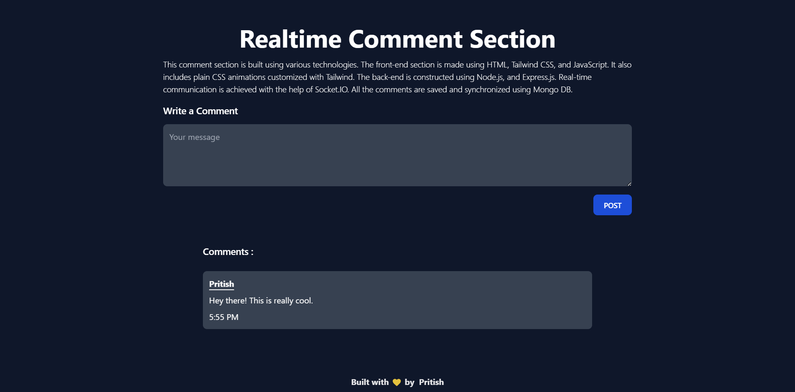

<p align="center">
  
</p>

<h1 align="center"> realtime-comment-section </h1>
<h4 align="center"> a simulation of a real-world comment section where different users can simultaneously type, read and post comments </h4>

### About
The **comment section** is built using various technologies. The front-end section is made using **HTML, Tailwind CSS, and JavaScript**. It also includes plain **CSS animations** customized with Tailwind. The back-end is constructed using **Node.js, and Express.js**. Real-time communication is achieved with the help of **Socket.IO**. All the comments are **saved and synchronized** using **Mongo DB**.

### Technologies

[](https://www.mongodb.com/) </br>
 </br>
[](https://expressjs.com/) </br>
 </br>
 </br>

### Features
- does not allow the user to write comments unless they provide a proper username
- retrieves the comments from the database and displays them on the feed
- notifies other users about the user which is currently typing
- updates the comment in realtime across all the sockets

### Installation
clone the repository
```sh
gh repo clone PritishMishraa/realtime-comment-section
```
install the dependencies
```sh
npm install
```
run 
```sh
npm run dev
```
